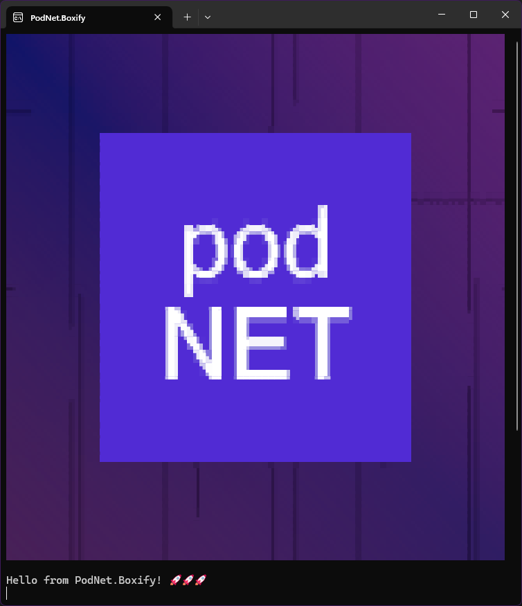
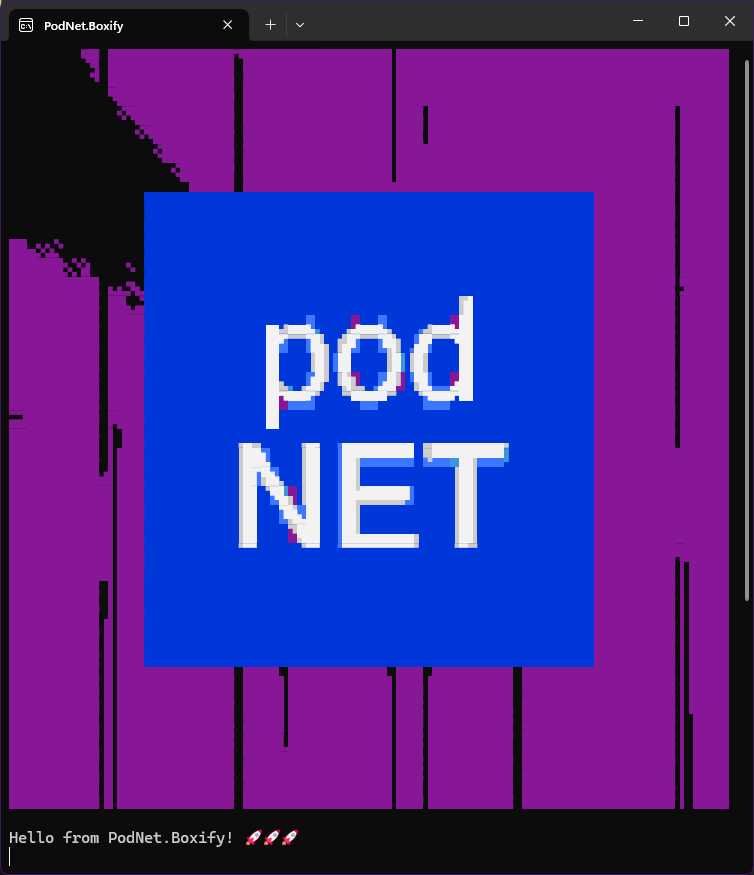

# PodNet.Boxify [](https://www.nuget.org/packages/PodNet.Boxify/)
Convert your image to Unicode box-drawings using semigraphics. Write your graphics into strings, text files or even terminals with optional colorization!

## Usage

1. Install the package to your project:
    ```cmd
    dotnet add package PodNet.Boxify
    ```
3. Then, either:

    a. define your own `IBoxBitmapSource`, OR
   
    b. use one of the extension packages:

    ```cmd
    dotnet add package PodNet.Boxify.Bitmap
    dotnet add package PodNet.Boxify.Svg
    ```

> [!NOTE]
> You can skip installing the core package if you decide to use one of the extensions, because it transitively references the core package. Do note however, that the extension packages take a dependency on `System.Drawing`, with the `PodNet.Boxify.Svg` package ambiently taking a dependency on `System.Drawing` through the [`Svg`](https://github.com/svg-net/SVG) package. 
> If you supply your own `IBoxBitmapSource` (which is a simple wrapper around "how to get a pixel from and image"), you can simply define your own logic and minimize additional dependencies. The core package has no dependencies besides .NET Standard 2.0 APIs.

3. Finally, supply your image and draw your box art:

    ```csharp
    using PodNet.Boxify;
    using PodNet.Boxify.Svg;

    // Get your graphics from wherever
    var podnet = """
    <svg width="1024" height="1024" viewBox="0 0 1024" xmlns="http://www.w3.org/2000/svg">
        <path stroke-width="4" stroke="#fff" d="M133 0v570m0 143v311m19-518v518M326 0v333m0 246v445m67-597v508M548 0v471m0 146v407M593 0v133m0 530v361M723 0v363m0 249v412m56-692v508M950 0v540m0 145v339m15-548v548M0 151h50M0 496h15m271-252h198M224 600h346m93-276h361m-24-174h24m-3 345h3"/>
        <path fill="#000" stroke-width="1" stroke="#fff" d="M192 192h640v640H192z"/>
        <text font-family="Open Sans" x="192" y="512" font-size="192px" text-anchor="middle" fill="#fff">
          <tspan x="512" y="472">pod</tspan><tspan x="512" y="672" font-weight="bold">NET</tspan>
        </text>
    </svg>
    """;

    // You can set the Console's output encoding to properly display the characters. Usually only needed for high-res pixel palettes.
    Console.OutputEncoding = System.Text.Encoding.UTF8;

    // Choose from a range of palettes to use
    var palette = PixelPalette.Halves;

    // You can render only bitmaps. Use PodNet.Boxify.Bmp to wrap a simple System.Drawing.Bitmap, PodNet.Boxify.Svg to convert an
    // SVG to a wrapped System.Drawing.Bitmap, or supply your own by implementing this simple interface.
    IBoxBitmapSource bitmap = SvgConverter.Default.Convert(podnet, palette, maxRows: 40);

    var boxDrawing = Renderer.Default.Render(bitmap, palette);
    Console.WriteLine(boxDrawing);
    ```

    Which outputs on the console:

```cmd
          █              █                █   █         █                 █     
          █              █                █   █         █                 █     
          █              █                █   █         █                 █     
          █              █                █   █         █                 █     
          █              █                █   █         █                 █     
          █              █                █   ▀         █                 █   ▄▄
          █              █                █             █                 █     
          █    ▄▄▄▄▄▄▄▄▄▄█▄▄▄▄▄▄▄▄▄▄▄▄▄▄▄▄██▄▄▄▄▄▄▄▄▄▄▄▄█▄▄▄▄▄▄▄▄         █     
          █    █                                                █         █     
          █    █                                                █         █     
          █    █                                                █         █     
          █    █                                                █         █     
          █    █                                                █▄▄▄▄▄▄▄▄▄█▄▄▄▄▄
          █    █                                  ██            █         █     
          █    █            ▄▄ ▄▄▄    ▄▄▄▄    ▄▄▄▄██            █         █     
          █    █            ██▀▀▀██ ▄██▀▀▀█▄ ██▀▀▀██            █         █     
          █    █            ██    ████    ██ ██   ██            █         █     
          █    █            ██▄  ▄█ ▀██  ▄█▀ ██  ▄██            █         █     
          █    █            ██▀▀▀▀    ▀▀▀▀▀   ▀▀▀▀▀▀            █         █▄    
▀         █    █            ██                                  █         ██    
          ██   █          ▄▄     ▄▄  ▄▄▄▄▄▄▄▄ ▄▄▄▄▄▄▄▄▄         █         ██    
          ██   █         ███▄    ██  ████████ ▀████████         █          █    
          ▀█   █         █████   ██  ██           ██            █          █    
           █   █         ███ ██▄ ██  ████████     ██            █          █    
           █   █         ███  ▀█▄██  ██           ██            █          █    
           █   █         ███   ▀███  ██▄▄▄▄▄▄▄    ██            █          █    
           █   █          ▀▀     ▀▀  ▀▀▀▀▀▀▀▀     ▀▀            █          █    
           █   █                                                █         ██    
          ██   █                                                █         ██    
          ██   █                                                █         ██    
          ██   █                                                █         ██    
          ██   █                                                █         ██    
          ██   ▀▀▀▀▀▀▀▀▀▀█▀▀▀▀██▀▀▀▀▀▀▀▀▀▀██▀██▀▀▀▀▀▀▀▀▀█▀▀▀██▀▀▀         ██    
          ██             █    █           █   █         █                 ██    
          ██             █    █           █   █         █                 ██    
          ██             █    █           █   █         █                 ██    
          ██             █    ▀           █   █         █                 ██    
          ██             █                █   █         █                 ██    
          ██             █                █   █         █                 ██    
          ██             █                █   █         █                 ██    
```

## Advanced use cases

This library is designed to be extendable at each point. The simplest way to go is just install the package and **inherit from one of the classes** that define the behaviors you want to override or customize.

See the in-code documentation for each class on further instructions and tips on how to define your own behaviors and customizations.

If the instructions aren't too clear, feel free to get in touch.

### `PixelAnalyzer`
These determine if a pixel should be drawn or not in a monochrome image, or what shade they should be a in a shaded image. Use the appropriate one for your image sources: `PixelAnalyzer.Alpha`, `PixelAnalyzer.HueSaturationBrightness` or `PixelAnalyzer.AlphaXHueSaturationBrightness` (the default), or provide your own implementation to the `Renderer`.

### `PixelPalette`
The palette maps a chunk of pixels to the appropriate character to draw. It has its pixels in order as if they were binary numbers so they can be quickly looked up given an index (also itself a binary bitmap technically). You can choose from `Halves`, `Thirds`, `Quarters`, `Quadrants`, `Sextants`, `Octants`, `Shades`, or supply your own implementation by deriving from `PixelPalette`. Do note that higher "resolution" palettes require support on the client doing the actual rendering (like a terminal or a web browser). If you have control over it, consider using [Cascadia Code](https://github.com/microsoft/cascadia-code) as the font, which supports even octants for the highest resolution currently possible. It's also a great monospaced font by the way for all your IDEs, code editors and terminals.

### `Renderer`
The default renderer has many hooks you can hook into to customize the rendering process, including drawing a line of pixels or determining and drawing a composite pixel (box).

### `RenderOptions` and `RenderContext`
You can consider inheriting from these if you write your own `Renderer` or `Colorizer`, and need more state to pass through the rendering process. The `RenderOptions` are passed by the user to the `Renderer`.

### `Canvas`
If you want to use your custom endpoint for drawing the characters, this is the hook you can inherit from. The default implementation simply wraps a `StringBuilder`.

### `IBoxFrame` and Framing the Graphics
If you want to wrap the result in a frame (to inject some markup before and after rendering the graphics or before each line, or add some embellishments for example), this is the interface to implement. Also see `BoxFrame` for a default embellishment frame you can use.

Want to embed your graphics somewhere? Try `BoxFrame.Default with { LinePrefix = "/// " };` to embed the graphics in a C# XMLDoc comment for example, without needing to manually manipulate the resulting string.

### `IBoxBitmapSource`
The simplest interface in the world: you have to tell the `Height` and `Width` of the bitmap you want to render, and provide the logic for actually getting a pixel at a given coordinate. Easiest-peasiest. See `PodNet.Boxify.Bmp` for the simple reference implementation that wraps `System.Drawing.Bitmap`.

### `IColorizer` and Colorization
Well, well, well. It's not just that you want to do some pixel-graphics, you also want them to look like the rainbow? Fear not! You can supply your own implementation for `IColorizer` if you want to manually colorize your box-drawings.

You can also use `CccTerminalRgbColorizer` (which uses [Color Cell Compression](https://en.wikipedia.org/wiki/Color_Cell_Compression), hence the name) to RGB-colorize your image in the terminal:

```csharp
/// This is a colorized SVG image (with gradients!)
var podnet = """
<svg width="1024" height="1024" viewBox="0 0 1024" xmlns="http://www.w3.org/2000/svg">
  <defs>
    <linearGradient id="grad1" x1="0%" y1="0%" x2="100%" y2="100%">
      <stop offset="0%" stop-color="#101468" />
      <stop offset="70%" stop-color="#381D65" />
      <stop offset="100%" stop-color="#2F1D63" />
    </linearGradient>
    <linearGradient id="grad2" x1="0%" y1="100%" x2="100%" y2="0%">
      <stop offset="0%" stop-color="#492158" />
      <stop offset="50%" stop-color="#381D65" stop-opacity="0" />
      <stop offset="100%" stop-color="#5C2373" />
    </linearGradient>
  </defs>

  <rect width="100%" height="100%" fill="url(#grad1)" />
  <rect width="100%" height="100%" fill="url(#grad2)" />

  <path stroke-opacity=".5" stroke-width="4" stroke="#000" d="M133 0v570m0 143v311m19-518v518M326 
    0v333m0 246v445m67-597v508M548 0v471m0 146v407M593 0v133m0 530v361M723 0v363m0 
    249v412m56-692v508M950 0v540m0 145v339m15-548v548M0 151h50M0 496h15m271-252h198M224 
    600h346m93-276h361m-24-174h24m-3 345h3"/>
  <path fill="#512BD4" d="M192 192h640v640H192z"/>
    <text font-family="Open Sans" x="192" y="512" font-size="192px" text-anchor="middle" fill="#fff">
    <tspan x="512" y="472">pod</tspan><tspan x="512" y="672" font-weight="bold">NET</tspan>
  </text>
</svg>
""";

Console.OutputEncoding = System.Text.Encoding.UTF8;
var palette = PixelPalette.Octants;
var bitmap = SvgConverter.Default.Convert(podnet, palette, maxRows: 40);
var boxDrawing = Renderer.Default.Render(bitmap, palette, colorizerFactory: context => new CccTerminalRgbColorizer(context));
Console.WriteLine(boxDrawing);
Console.WriteLine("Hello from PodNet.Boxify! 🚀🚀🚀");
```



You can even supply your own `LegacyTerminalColorPalette` or use the predefined `Campbell` or `LegacyCmd` palettes to color-match (try to use the color palette as defined in your terminal app for more precise results) to a more retro look:

```csharp
var boxDrawing = Renderer.Default.Render(
        bitmap, 
        palette,
        colorizerFactory: context => new CccTerminalRgbColorizer(
            context, 
            LegacyTerminalColorPalette.Campbell)));
```



> [!NOTE]
> The terminal colorizer uses [Virtual Terminal Sequences](https://learn.microsoft.com/en-us/windows/console/console-virtual-terminal-sequences#text-formatting), which the terminals interpret, but the raw string is interweaved with some `\e[38;2;255;255;255m` and similar codes. The console colors are not being set using the .NET APIs `Console.BackgroundColor` or `Console.ForegroundColor`.

## Contributing and Support

This project is intended to be widely usable, but no warranties are provided. If you want to contact us, feel free to do so in the org's [[Discussions](https://github.com/orgs/podNET-Hungary/discussions/)], at our website at [podnet.hu](https://podnet.hu), or find us anywhere from [LinkedIn](https://www.linkedin.com/company/podnet-hungary/) to [Meetup](https://www.meetup.com/budapest-net-meetup/), [YouTube](https://www.youtube.com/@podNET) or [X](https://twitter.com/podNET_Hungary).

Any kinds of contributions from issues to PRs and open discussions are welcome!

Don't forget to give us a ⭐ if you like this repo (it's free to give kudos!) or share it on socials!

## Sponsorship

If you're using our work or like what you see, consider supporting us. Every bit counts. 🙏 [See here for more info.](https://github.com/podNET-Hungary/PodNet.NuGet.Core/blob/main/src/PodNet.NuGet.Core/build/SPONSORS.md)
